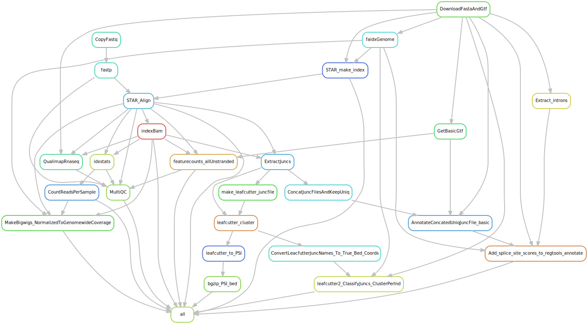

# Snakemake Workflow – RNAseq

**Author:** Dylan Stermer  
**Affiliation:** University of Chicago, Genetics  
**Contact:** dylanstermer@uchicago.edu  
**Version:** 1.0  
**Last Updated:** 2025-11-08

---

## Description

This workflow contains rules to download genome files, index genomes and align reads with STAR, perform basic QC, count splice junction reads (regtools) and gene reads (featureCounts). Can handle different samples from different species, as defined in `config/STAR_Genome_List.tsv` and `config/samples.tsv`. Because this is often just the start of an RNA-seq analysis, this workflow might be best used as a module in a Snakemake workflow that further extends this work.

---

## Repository Structure
```
project_root/
├── workflow/
│   ├── Snakefile
│   ├── rules/
│   │   ├── common.py
│   │   ├── IndexGenome.smk
│   │   ├── PreprocessAndAlign.smk
│   │   ├── QC.smk
│   │   ├── ExpressionAnalysis.smk
│   │   └── SplicingAnalysis.smk
│   ├── envs/
│   │   ├── fastp.yml
│   │   ├── subread_featureCounts.yml
│   │   ├── qualimap.yml
│   │   └── ...
│   └── scripts/
│       ├── ExtractIntronsFromGtf.py
│       ├── CountsToExpressionMatrix.py
│       ├── leafcutter/
│       └── ...
├── config/
│   ├── config.yaml
│   ├── samples.tsv
│   └── STAR_Genome_List.tsv
├── results/
│   ├── Alignments/
│   ├── QC/
│   ├── featureCounts/
│   └── SplicingAnalysis/
├── logs/
├── .gitignore
└── README.md
```

---

## Usage

### Step 1: Configure workflow

Edit `config/config.yaml` to set paths and parameters.

Create `config/samples.tsv` with your sample metadata 

Create `config/STAR_Genome_List.tsv` with genome information 

### Step 2: Install dependencies

Create and activate the conda environment:
```bash
conda env create -f rnaSeqAnalysis.yaml
conda activate rnaSeqAnalysis
```

### Step 3: Execute workflow

Test your configuration by performing a dry-run via:
```bash
snakemake -n
```

Execute the workflow locally via:
```bash
snakemake --cores $N
```

using `$N` cores or run it in a cluster environment via the included slurm snakemake profile:
```bash
snakemake --profile snakemake_profiles/slurm  --conda-frontend conda
```

---

## Configuration Files

### samples.tsv

Required columns: `sample`, `STARGenomeName`, `Strandedness`, `Aligner`, `R1`, `R2`

Optional columns: `StudyFirstAuthor`, `cell_type`, `Approach`, `Description`, `SRA_accession`, `Platform`, `R1_link`, `R2_link`

The `sample` column defines output file names. `STARGenomeName` specifies which genome to use from `STAR_Genome_List.tsv`. `R1` and `R2` provide paths to local FASTQ files, or leave blank and provide `SRA_accession` to download from SRA. `Strandedness` should be `U` (unstranded), `FR` (forward), or `RF` (reverse). `Aligner` should be `STAR` or `minimap2`.

Example:
```
sample	STARGenomeName	R1	R2	SRA_accession	Strandedness	Aligner
sample1	hg38	/path/to/R1.fq.gz	/path/to/R2.fq.gz		U	STAR
```

## Overview 

